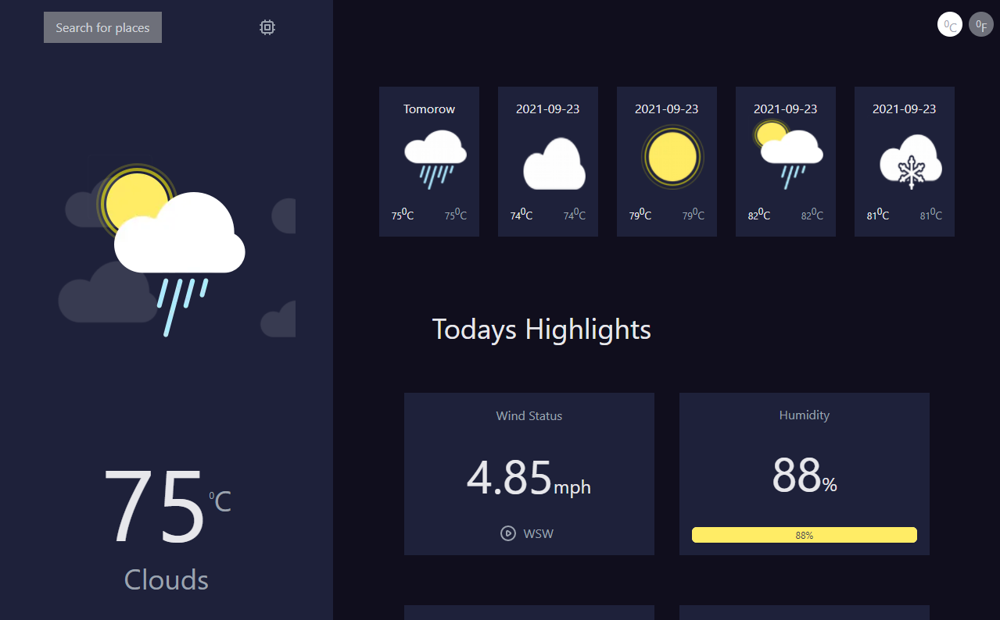
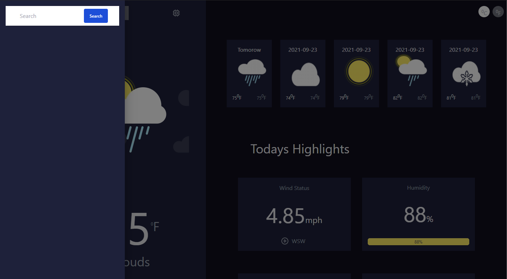

<!-- Please update value in the {}  -->

<h1 align="center">{Clima}</h1>

<div align="center">
   Solution for a challenge from  <a href="https://investondaba.notion.site/daba-Front-End-Advanced-Test-1-e75b281f295e4457acac147d70312ee2" target="_blank">daba front end advanced coding exercise</a>.
</div>

<div align="center">
  <h3>
    <a href="https://clima-next.vercel.app/">
      Demo
    </a>
    <span> | </span>
    <a href="https://github.com/musahibrahimali/react-clima">
      Solution
    </a>
    <span> | </span>
    <a href="https://investondaba.notion.site/daba-Front-End-Advanced-Test-1-e75b281f295e4457acac147d70312ee2">
      Exercise
    </a>
  </h3>
</div>

<!-- TABLE OF CONTENTS -->

## Table of Contents

- [Overview](#overview)
  - [Built With](#built-with)
- [Features](#features)
- [How to use](#how-to-use)
- [Contact](#contact)
- [Acknowledgements](#acknowledgements)

<!-- OVERVIEW -->

## Overview





view demo at >>> <<https://www.youtube.com/watch?v=i7JUf6ati4I> />

Introduce your projects by taking a screenshot, video recordings or a gif. Try to tell us about the solution you built by answering the following:

- Where can I see your demo?
<https://clima-next.vercel.app/>

- What was your experience building it.
intriguing and chanllenging yet fun to build

### Built With
<!-- This section should list any major frameworks that you built your project using. Here are a few examples.-->

- [React](https://reactjs.org/)
- [Vue.js](https://vuejs.org/)
- [Tailwind](https://tailwindcss.com/)
- [next.js](https://nextjs.org/)
- [material ui](https://mui.com/)
- [open weather](https://openweathermap.org/)

## Features

lazy-loading

- shimmer-effects during data loading
- search places for weather data
<!-- List the features of your application or follow the template. Don't share the figma file here :) -->

What features did you develop?

- searching functionality
- user location by default
- shimmer effect on loading
- lazy loading for images
- switch between celcius and fahrenheight

## How To Use

The program by default ask and uses users location to update the weather data, and tehn comew with the search functionality
<!-- Example: -->

To clone and run this application, you'll need [Git](https://git-scm.com) and [Node.js](https://nodejs.org/en/download/) (which comes with [npm](http://npmjs.com)) installed on your computer. From your command line:

```bash
# Clone this repository
$ git clone https://github.com/musahibrahimali/react-clima

# Install dependencies
$ npm install

# Run the app
$ npm start
```

This is a [Next.js](https://nextjs.org/) project bootstrapped with [`create-next-app`](https://github.com/vercel/next.js/tree/canary/packages/create-next-app).

## Getting Started

First, run the development server:

```bash
npm run dev
# or
yarn dev
```

Open [http://localhost:3000](http://localhost:3000) with your browser to see the result.

You can start editing the page by modifying `pages/index.js`. The page auto-updates as you edit the file.

[API routes](https://nextjs.org/docs/api-routes/introduction) can be accessed on [http://localhost:3000/api/hello](http://localhost:3000/api/hello). This endpoint can be edited in `pages/api/hello.js`.

The `pages/api` directory is mapped to `/api/*`. Files in this directory are treated as [API routes](https://nextjs.org/docs/api-routes/introduction) instead of React pages.

## Learn More

To learn more about Next.js, take a look at the following resources:

- [Next.js Documentation](https://nextjs.org/docs) - learn about Next.js features and API.
- [Learn Next.js](https://nextjs.org/learn) - an interactive Next.js tutorial.

You can check out [the Next.js GitHub repository](https://github.com/vercel/next.js/) - your feedback and contributions are welcome!

## Deploy on Vercel

The easiest way to deploy your Next.js app is to use the [Vercel Platform](https://vercel.com/new?utm_medium=default-template&filter=next.js&utm_source=create-next-app&utm_campaign=create-next-app-readme) from the creators of Next.js.

Check out our [Next.js deployment documentation](https://nextjs.org/docs/deployment) for more details.
